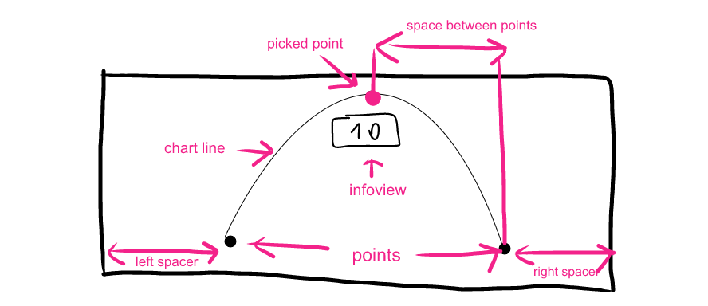

# ▤ SwiftyScrollableGraph
[](http://cocoapods.org/pods/swiftyScrollableGraph)
[](http://cocoapods.org/pods/swiftyScrollableGraph)
[](http://cocoapods.org/pods/swiftyScrollableGraph)

### If you like SwiftyScrollableGraph, give it a ★ at the top right of this page.

> Hi, I'm George Ivanov, and i am an iOS developer. Most time i spend coding and playing guitar.
> * Check out my aps in [App Store](https://itunes.apple.com/us/developer/george-ivanov/id1287458597).
> * [**Hire me**](mailto:omfghelo@gmail.com) to help you with your projects. 
> * Building and maintaining this free library takes time. Help keep me awake via [PayPal](https://www.paypal.me/IvanovGeorge).

## Overview

SwiftyScrollableGraph issan easy to setup and use scrollable graph view for swift. Customizable, fast and clean.
 * Adding in storyboard just with drag and drop 
 * Auto calculate all x and y point position in any size. Place your SwiftyScrollableGraph anywhere you need.
 * A lot customizations variants without lot of custom code
 * Curve algorithm based on [Ramsundar Shandilya](https://github.com/Ramshandilya) CubicCurveAlgorithm
 
Check out sample project, to see it in action!

### Preview

| Gif example | 
| --- |
|  |

## Installation
### CocoaPods

[CocoaPods](http://cocoapods.org) is a dependency manager for Cocoa projects. You can install it with the following command:

```bash
$ gem install cocoapods
```

To integrate SwiftyScrollableGraph into your Xcode project using CocoaPods, specify it in your `Podfile`:

```ruby
source 'https://github.com/CocoaPods/Specs.git'
platform :ios, '11.0'
use_frameworks!

pod 'SwiftyScrollableGraph'

```

Then, run the following command:

```bash
$ pod install
```

## Usage
### Code-less Storyboard Implementation

1. Add default view on your storyboard, and set it's class as SwiftyScrollableGraph

2. Make an outlet from you SwiftyScrollableGraph to your code

3. Now, in viewDidLoad (or anywhere you need to start drawing or updating the graph) add some data to graph by calling this: 
``` swift
yourSwiftyScrollableGraph.reloadGraphWith(pointsData: [(value: 11, description: "Jan."),(value: 2, description: "Feb."),(value: 33, description: "Mar."),(value: 0, description: "Apr.")])
```
And it's done! Build and run your project, and you should see default graph draw. 

### Customization

> There is full list of command you may want to use for your graph. You can also check the sample project, where most of them are implemeted.

> This eample could be helpfull for understandig base terms.



> Code examples:

``` swift

reloadGraphWith(pointsData: [(value: Int, description: String?)]) // loads data to graph and draw it. Value is point y-axis coordinate. Description is an optional field, that would show in infoView and(or) on xAxisLine.

reloadGraph() // Reloading graph. Usually called, after you make some design changes, without reloading the point values.  

infoView = UIView // You can override default infoView. Ignore it, or set to nil to use default infoView if you dont need custom implementation.

backgroundColor  = UIColor // background color

spaceBetweenPoints = CGFloat // Space beetween two point on xAxis

animation = Bool // ebale or disable graph draw animation

animationTime = CFTimeInterval // time, which graph animation will take if enabled

leftSpacer = CGFloat // left safe space, so you can scroll to the first point

rightSpacer = CGFloat // right safe space, so you can scroll to the last point

chartLine.color = UIColor // chartline color

chartLine.size = CGFloat // charline size

pickedPoint.size = CGFloat // current "picked" point size. Set to 0, to not to show it

pickedPoint.color = UIcolor // current "picked" point color

points.size = CGFloat // all graph points size. Set to 0, not to show them

points.color = UIColor // graph points color

xAxisLine.isOn = Bool // show or hide xAxis Line

xAxisLine.size = CGFloat // xAxis line size 

xAxisLine.color = UIColor // xAxis line color

yAxisLine.isOn = Bool // show or hide yAxis Line

yAxisLine.size = CGFloat // yAxis line size 

yAxisLine.color = UIColor // xAxis line color

autoScroll = Bool //  enables or disables autoscrolling to the end of graph on draw  


```
